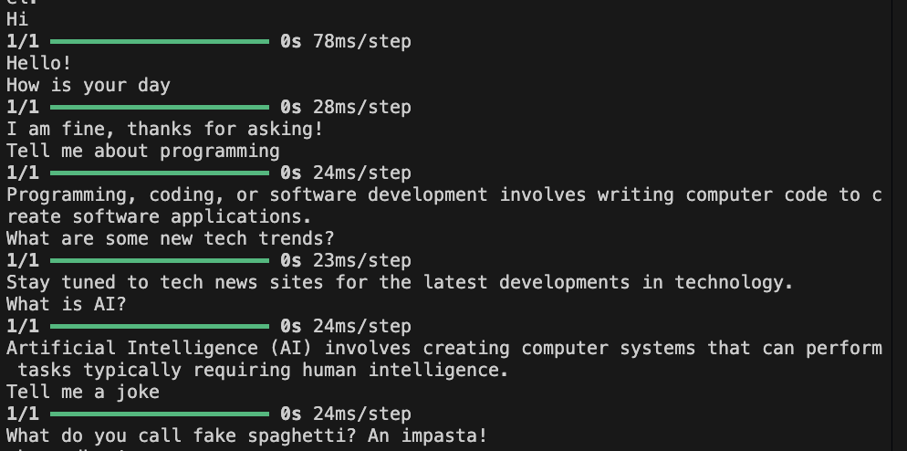

## AI Chatbot 

### Overview
A chatbot built using a neural network model. It's trained to classify user inputs into predefined intents and provide appropriate responses based on the trained model. The training data and model are created using TensorFlow and NLTK, and the chatbot can interact with users via a command-line interface.

### Prerequisites
- Python 3.6 or higher
- TensorFlow, Keras
- NLTK
- NumPy

### Usage
- Clone the repository & install the necessary libraries
```pip install ... ```
- run training.py script to train the model
- run chatbot.py script to interact with the trained chatbot
- customize your chatbot by adding on to intents.json and re-training the model
- demo screenshot


